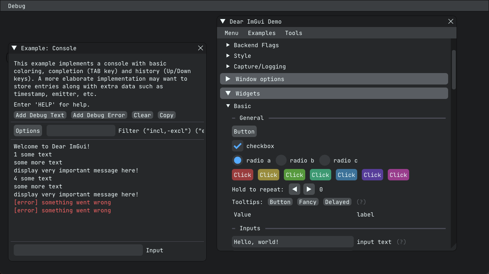

# imgui (CMake)

ImGui application template with GLFW for rendering and CMake for building.



## Build as native app


```
mkdir -p build
cd build
cmake ..
cmake --build . -j4
```


## Build as web app

Use emscripten for building:

```
source /path_to_emsdk/emsdk_env.sh
mkdir -p build 
cd build
cmake .. -DCMAKE_TOOLCHAIN_FILE=/path_to_emsdk/emscripten/<version>/cmake/Modules/Platform/Emscripten.cmake
cmake --build . -j4
cd ..
```

Run the app:

```
cd ui-web
python3 -m http.server
open index.html
```

## Dependencies

* Dear ImGui
* glad
* GLFW
* OpenGL 3
* fmtlib
